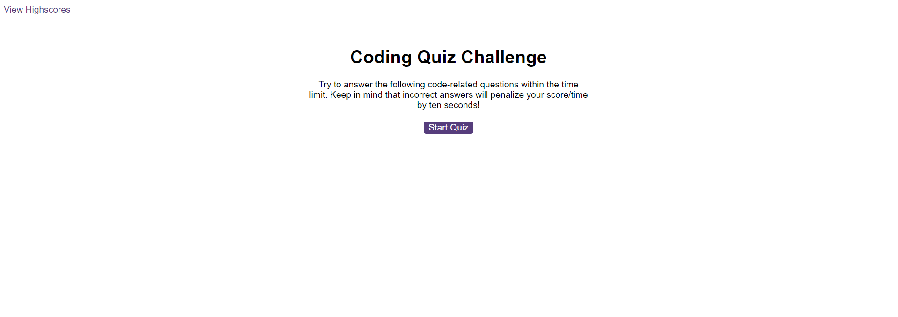
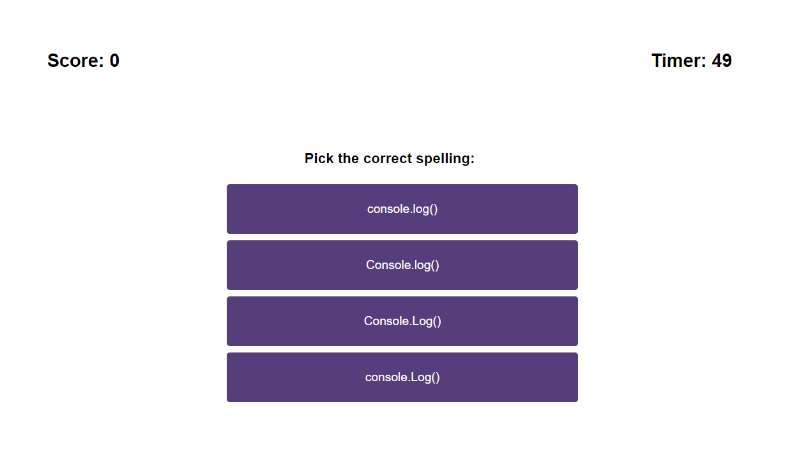
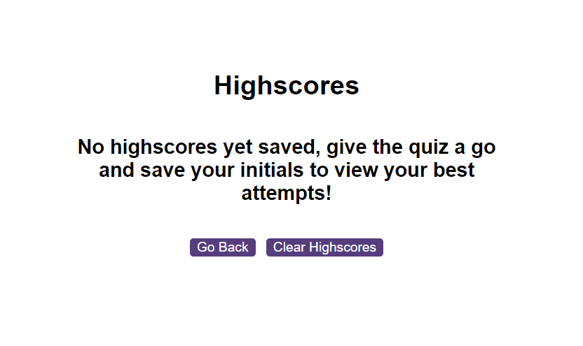

# multiple-choice-quiz
A multiple choice quiz using JavaScript DOM model

## Deployment

__[Github Repository](https://github.com/jbkennaugh/multiple-choice-quiz)__

__[Deployed Website](https://jbkennaugh.github.io/multiple-choice-quiz/)__

## Screenshots 

### Starting page

### During the quiz

### The highscores page

## License

Please refer to the LICENSE in the repository

## Credits

Credit to Google Fonts for their font 'ABeeZee'